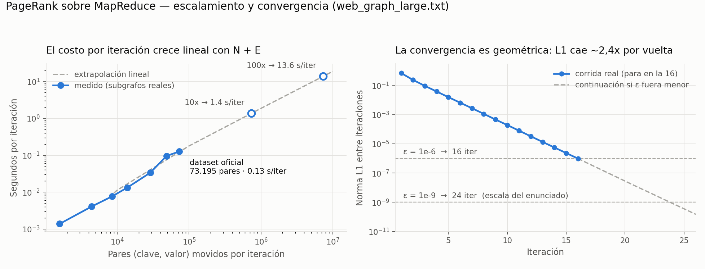

# ANALYSIS.md — PageRank con MapReduce

**Autor(es):** Valentina Rendón Claro  **Fecha:** 31 de agosto de 2026

Todas las cifras de este documento provienen de corridas reales sobre
`web_graph_large.txt` (10.000 nodos, 63.195 aristas, 300 dangling), el dataset
oficial de la entrega. Los conteos de pares no están estimados: `pagerank.py`
instrumenta el mapper y reporta el volumen medido en cada iteración.

---

## 1. Volumen de shuffle por iteración

### 1.1 La fórmula

El mapper recibe un ítem por nodo y emite exactamente dos clases de mensaje:

| Mensaje | Cuántos emite cada nodo | Total por iteración |
| --- | --- | --- |
| `STRUCT` | 1, siempre (dangling incluidos) | **N** |
| `RANK` | uno por vecino = `out_degree(nodo)` | **E** |

Como `Σ out_degree(v) = E` por definición, el volumen total es exactamente

```
pares emitidos por iteración = N + E
```

y es **constante en todas las iteraciones**: no depende de los valores de rank,
solo de la forma del grafo, que no cambia. `test_pagerank.py` lo verifica en
`TestVolumenDeShuffle`.

### 1.2 Los números medidos

| Grafo | N | E | Pares por iteración | Iteraciones | Pares totales |
| --- | ---: | ---: | ---: | ---: | ---: |
| `web_graph_sample.txt` | 8 | 12 | 20 | 26 | 520 |
| `web_graph_medium.txt` | 1.000 | 6.136 | 7.136 | 17 | 121.312 |
| **`web_graph_large.txt`** | **10.000** | **63.195** | **73.195** | **16** | **1.171.120** |

Los 73.195 pares del grafo grande se descomponen en 10.000 `STRUCT` (13,7 %) y
63.195 `RANK` (86,3 %), y coinciden con la escala de referencia que da el
enunciado (~73.000).

### 1.3 El precio de preservar el grafo

Los N mensajes `STRUCT` son el costo explícito de la decisión de diseño de §3
del `DESIGN.md`: transportar la adyacencia por el mismo canal que los datos en
lugar de guardarla en un estado externo. En este grafo son **13,7 % del
shuffle**. Con un grafo más denso el porcentaje baja (el término E domina); con
uno más disperso sube. En el caso extremo de un grafo sin aristas serían el
100 %, pero también sería el único caso donde no hay nada que calcular.

Vale la pena señalar lo que ese 13,7 % compra: sin él, el reducer no puede
devolver un ítem con la misma forma que la entrada y **el grafo desaparece del
estado en la segunda iteración** (verificado en
`test_sin_struct_el_grafo_se_destruye_en_dos_iteraciones`).

### 1.4 Lo que NO se emite: la masa colgante

La alternativa "cada dangling enlaza a todos los nodos" es matemáticamente
equivalente a la implementada, pero el mapper tendría que emitir N mensajes por
cada nodo colgante:

| Estrategia de dangling | Pares por iteración | Factor |
| --- | ---: | ---: |
| Masa calculada en el driver (implementada) | 73.195 | 1× |
| Dangling enlaza a todos, emitido desde el mapper | 3.073.195 | **42×** |

300 dangling × 10.000 nodos = 3.000.000 de pares extra por vuelta, para
transportar una información que es **un solo número flotante**. Como todos los
nodos reciben exactamente `D/N`, el reparto se hace algebraicamente dentro del
reducer y `D` se obtiene con un barrido `O(N)` en el driver. Es la optimización
de mayor impacto del diseño.

### 1.5 Memoria: el shuffle se materializa completo

El framework construye la lista `mapped` con **todos** los pares antes de
agrupar. Medido con `tracemalloc` sobre el grafo grande: **9,0 MB** para los
73.195 pares de una sola fase MAP. Es un costo lineal en `N + E` que se paga
entero en cada iteración, y es la razón por la que este framework single-node no
llegaría muy lejos del millón de nodos sin partir el trabajo.

---

## 2. Dónde pondría un combiner y qué pre-agregaría

### 2.1 Ubicación y contenido

El combiner iría **entre MAP y SHUFFLE**, sobre la salida de cada mapper, y
pre-agregaría **únicamente los mensajes `RANK`**:

```
combiner(clave, valores_parciales):
    suma = Σ de los payloads etiquetados RANK
    emitir (clave, ("RANK", suma))        # un solo mensaje en vez de k
    reemitir los STRUCT sin tocarlos      # no son sumables
```

La razón de que funcione es que **la operación del reducer sobre los mensajes
`RANK` es una suma**: asociativa y conmutativa. Sumar `a + b` en el mapper y
después `(a+b) + c` en el reducer da el mismo resultado que sumar los tres
juntos, así que agregar temprano no cambia la respuesta. Esa es exactamente la
condición que Hadoop exige para admitir un combiner.

Los mensajes `STRUCT` **no se pueden combinar**: hay exactamente uno por clave y
su contenido es una lista, no un valor agregable. Un combiner que intentara
"sumar" dos STRUCT estaría corrompiendo el grafo.

### 2.2 Cuánto reduciría el shuffle — medido

El ahorro depende de cuántos mapper-splits haya, porque el combiner solo puede
agregar lo que ve dentro de su propia partición. Simulé el particionado del
input en M splits sobre el grafo grande:

| Configuración | `STRUCT` | `RANK` | Total | Reducción |
| --- | ---: | ---: | ---: | ---: |
| Sin combiner | 10.000 | 63.195 | 73.195 | — |
| 256 splits | 10.000 | 61.696 | 71.696 | 2,0 % |
| 64 splits | 10.000 | 57.415 | 67.415 | 7,9 % |
| 16 splits | 10.000 | 45.005 | 55.005 | 24,9 % |
| 8 splits | 10.000 | 35.183 | 45.183 | 38,3 % |
| 4 splits | 10.000 | 24.409 | 34.409 | 53,0 % |
| 2 splits | 10.000 | 15.142 | 25.142 | 65,7 % |
| **1 combiner global (límite teórico)** | 10.000 | **8.629** | **18.629** | **74,5 %** |

El límite teórico son 8.629 mensajes `RANK` porque ese es el número de nodos que
reciben al menos un enlace: con un solo combiner, cada nodo destino recibiría un
único mensaje agregado en vez de uno por cada enlace entrante.

### 2.3 La lectura importante

**El combiner es más útil cuanto más concentrado esté el grafo.** El ahorro
viene de que muchos mensajes distintos van a la misma clave, y eso es
precisamente lo que pasa en un grafo de preferential attachment: un hub que
recibe 60 enlaces genera 60 mensajes que colapsan en 1. Dicho de otro modo,
**el combiner ataca justo el mismo fenómeno que causa el data skew de §3**, y por
eso los dos temas están conectados.

En el extremo opuesto, con muchos splits pequeños el combiner casi no ve
repeticiones dentro de su partición y el ahorro se desvanece (2 % con 256
splits). No es gratis tampoco: cuesta CPU y memoria en el mapper, así que solo
compensa cuando el shuffle es el cuello de botella — que es el caso típico en
un clúster real, donde mover datos por la red es mucho más caro que sumar.

El framework de los labs **no tiene combiners**: `mapreduce()` hace
`mapped.extend(mapper(item))` y pasa directo al `defaultdict`. Por eso los
73.195 pares se mueven completos en cada iteración.

---

## 3. Data skew: qué pasa con un in-degree gigantesco

### 3.1 El skew es real y medible

Los grafos medium y large se generaron con preferential attachment, así que la
distribución de in-degree tiene cola larga. Medido sobre el grafo grande:

| Métrica de in-degree | Valor |
| --- | ---: |
| Máximo (el hub más enlazado) | **60** |
| Promedio (`E/N`) | 6,32 |
| Mediana | 4 |
| Percentil 90 | 15 |
| Percentil 99 | 31 |
| Percentil 99,9 | 51 |
| Nodos con in-degree 0 | 1.371 |
| **Factor de skew (máx / promedio)** | **9,5×** |

### 3.2 Qué reducer se vuelve el cuello de botella

El reducer de una clave recibe `1 STRUCT + in_degree(clave) mensajes RANK`. Su
trabajo es lineal en el tamaño de esa lista, así que **el reducer del hub más
enlazado hace 9,5 veces más trabajo que el reducer promedio y 60 veces más que
el de un nodo con un solo enlace entrante**.

En este framework single-node el impacto es despreciable: los reducers se
ejecutan en serie dentro de un `for`, así que lo único que importa es el trabajo
total, no cómo esté repartido. **El skew no cuesta nada aquí.**

Donde sí duele es en un MapReduce distribuido de verdad, y el mecanismo es
importante entenderlo: el shuffle asigna cada clave a un reducer, normalmente
por `hash(clave) % num_reducers`. Una clave **nunca se parte entre dos
reducers** — esa es la garantía que hace que el modelo funcione. Entonces la
tarea que le toque el hub procesa una lista desproporcionada, y como el job no
termina hasta que termina el último reducer, **el tiempo total lo fija el
straggler**, no el promedio. Con 100 reducers y este grafo, 99 terminarían
rápido y esperarían al que le tocó el hub.

### 3.3 Por qué acá el skew es moderado, y cuándo dejaría de serlo

Un factor de 9,5× es incómodo pero manejable. El 1 % de nodos más enlazados
concentra solo el 6,1 % de los mensajes `RANK`, así que la carga, aunque
desigual, no está dominada por un puñado de claves.

En la web real la cola es mucho más pesada: un dominio como Wikipedia acumula
millones de inlinks mientras la mediana sigue siendo un puñado. Ahí el factor de
skew se va a órdenes de magnitud y el straggler deja de ser una molestia para
convertirse en el problema. Las tres defensas habituales:

1. **Combiner** (§2) — es la mejor, porque reduce el problema en el origen: el
   hub recibe un mensaje agregado por split en vez de uno por enlace.
2. **Particionador personalizado** — repartir las claves calientes a mano en vez
   de confiar en el hash.
3. **Partir la clave caliente** — agregar un sufijo aleatorio (`hub_0`, `hub_1`,
   …) para dividirla entre varios reducers y hacer una segunda pasada que sume
   los parciales. Cuesta un job extra.

---

## 4. Conexión con Clase 5: por qué Spark sería más rápido

### 4.1 Cuántas veces se releen los datos

La pregunta del enunciado es concreta: con 30 iteraciones, ¿cuántas veces se
releen los datos? La respuesta es **30 veces, el grafo completo, una vez por
iteración**. No hay forma de evitarlo dentro del modelo: `mapreduce()` es una
función de una sola pasada y el bucle está afuera, así que cada vuelta vuelve a
materializar todo desde cero.

| Concepto | Con 16 iteraciones (nuestra corrida) | Con 30 iteraciones |
| --- | ---: | ---: |
| Lecturas completas del grafo | 16 | 30 |
| Datos releídos (archivo de 511 KB) | 8,0 MB | 15,0 MB |
| Pares movidos por el shuffle | 1.171.120 | 2.195.850 |
| Listas `mapped` materializadas | 16 × 9,0 MB | 30 × 9,0 MB |

En nuestra implementación esas relecturas son de memoria RAM, porque el grafo
cabe en un proceso Python. En un MapReduce real sobre Hadoop la historia es
peor: **cada iteración lee de HDFS y escribe su salida a HDFS**, con replicación
(por defecto ×3), para que la siguiente iteración la vuelva a leer. Treinta
iteraciones son treinta ciclos completos de disco→red→disco de un dato que
nunca cambió de forma.

### 4.2 Qué es exactamente lo que se relee de más

Acá está el punto fino, y es la consecuencia directa de la decisión de diseño de
`DESIGN.md` §3: **la lista de adyacencia es inmutable y aun así viaja en cada
iteración.** El grafo no cambia nunca — lo único que cambia son 10.000 números
flotantes. Pero el modelo MapReduce no tiene dónde dejar guardada la parte
inmutable, así que los 10.000 mensajes `STRUCT` se emiten, se agrupan y se
reducen 16 veces seguidas transportando exactamente el mismo contenido.

De los 1.171.120 pares que movimos, **160.000 son adyacencias retransmitidas sin
que hayan cambiado en absoluto**.

### 4.3 Qué hace Spark distinto

Spark ataca precisamente eso. La estructura del grafo se carga una vez a un RDD
persistido en memoria (`.cache()` / `.persist()`), y en cada iteración solo se
hace el `join` con el vector de ranks, que es lo único que cambia:

```
enlaces = sc.textFile(...).map(parsear).partitionBy(p).cache()   # UNA vez
ranks   = enlaces.mapValues(lambda _: 1.0 / N)
for _ in range(30):
    contribuciones = enlaces.join(ranks).flatMap(repartir)
    ranks = contribuciones.reduceByKey(add).mapValues(aplicar_damping)
```

Tres diferencias concretas con lo que hicimos:

1. **La estructura se lee una sola vez.** El `cache()` mantiene `enlaces` en
   memoria a lo largo de las 30 iteraciones. Desaparece la necesidad del mensaje
   `STRUCT`: los 160.000 pares de adyacencia retransmitida se vuelven cero.
2. **`reduceByKey` lleva combiner incorporado.** Spark pre-agrega del lado del
   mapper por defecto, así que el ahorro que en §2 tuvimos que diseñar a mano
   viene gratis.
3. **`partitionBy` fija la partición una sola vez.** Si `enlaces` y `ranks`
   comparten particionador, el `join` de cada iteración es local y no vuelve a
   barajar la estructura por la red — solo se mueven los ranks.

El resultado es que en Spark el costo por iteración baja de "todo el grafo" a
"solo el vector de ranks", y el bucle deja de pagar E en cada vuelta. **Esa es
exactamente la limitación que esta tarea nos hizo sentir en carne propia**: no
es que MapReduce esté mal diseñado, es que fue diseñado para una pasada, y
PageRank necesita muchas.

---

## 5. Resultados sobre `web_graph_large.txt`

### 5.1 Top-15 por PageRank contrastado con in-degree

Convergencia en **16 iteraciones** (L1 final 9,75 × 10⁻⁷), Σ ranks = 1,000000000000, en ~2 segundos.

| # | Nodo | PageRank | In-degree | Puesto por in-degree | Δ puesto |
| ---: | --- | ---: | ---: | ---: | ---: |
| 1 | P01443 | 0,00116188 | 57 | 4 | +3 |
| 2 | P03367 | 0,00103648 | 59 | 3 | +1 |
| 3 | P06210 | 0,00090696 | 32 | 85 | **+82** |
| 4 | P09065 | 0,00089299 | 55 | 7 | +3 |
| 5 | P04814 | 0,00086030 | 60 | 1 | −4 |
| 6 | P00894 | 0,00082475 | 55 | 5 | −1 |
| 7 | P01977 | 0,00081174 | 49 | 12 | +5 |
| 8 | P07750 | 0,00080828 | 44 | 21 | +13 |
| 9 | P03428 | 0,00079943 | 15 | 1008 | **+999** |
| 10 | P07315 | 0,00078926 | 55 | 6 | −4 |
| 11 | P05650 | 0,00078824 | 22 | 383 | **+372** |
| 12 | P08541 | 0,00074021 | 29 | 136 | +124 |
| 13 | P00751 | 0,00073128 | 20 | 481 | **+468** |
| 14 | P07382 | 0,00072919 | 48 | 16 | +2 |
| 15 | P01632 | 0,00072150 | 41 | 28 | +13 |

Los hubs emergen como se esperaba: 10 de los 15 primeros están también entre los
30 primeros por in-degree. Los 5 restantes son el caso interesante y se explican
abajo.

### 5.2 Por qué la correlación no es perfecta

Correlación global entre PageRank e in-degree sobre los 10.000 nodos:

- **Pearson: 0,866**
- **Spearman (de rangos): 0,917**

Alta, como debe ser, pero lejos de 1. La razón es la definición misma del
algoritmo: el in-degree **cuenta** enlaces, mientras que PageRank los **pesa**
por la importancia del que enlaza y los **divide** por su out-degree. Un enlace
no vale lo mismo que otro.

El caso más claro del top-15 es **P03428**: puesto 1.008 por in-degree (solo 15
enlaces entrantes) pero **noveno por PageRank**. Al mirar quién lo enlaza se ve
por qué:

| Enlazador | Su puesto por PageRank | Su out-degree | Lo que le aporta |
| --- | ---: | ---: | ---: |
| P02659 | 116 de 10.000 | **1** | 0,00048373 |
| P04177 | 1.354 | **1** | 0,00019746 |
| P03123 | 101 | 9 | 0,00005577 |
| … otros 12 | — | 7–12 | 0,00018227 (sumados) |

Dos de sus enlazadores tienen **out-degree 1**: le entregan el 100 % de su rank
en vez de repartirlo. P02659, que es una página del top-2 % global, le pasa toda
su masa a P03428 y a nadie más. Esos dos enlaces solos aportan el 74 % de todo
lo que P03428 recibe.

El contraste lo confirma: **P06838** tiene el mismo in-degree (15) pero queda en
el puesto 3.709, con un rank 8,7 veces menor. Sus 15 enlazadores están casi
todos en la mitad inferior del ranking (puestos 1.490 a 9.930) y reparten su
rank entre muchos destinos. Mismo número de enlaces, **10,5 veces menos
contribución recibida**.

Esa es, en una línea, la razón de ser de PageRank: *quién* te enlaza importa
más que *cuántos* te enlazan.

---

## 6. Stretch: tiempo por iteración y proyección a mayor escala



### 6.1 Medición

Cronometré una iteración completa sobre subgrafos inducidos del grafo grande, de
1.000 a 10.000 nodos. Reporto el **mínimo** de 21 corridas por tamaño, no el
promedio: el ruido del planificador del sistema operativo solo puede sumar
tiempo, nunca restarlo, así que la corrida más rápida es la menos contaminada.
Con promedios los valores oscilaban hasta un 40 % entre ejecuciones; con el
mínimo la curva es estable y monótona.

| N | E | Pares/iteración | ms por iteración | Pares/segundo |
| ---: | ---: | ---: | ---: | ---: |
| 1.000 | 576 | 1.576 | 1,4 | 1.160.000 |
| 2.000 | 2.403 | 4.403 | 4,1 | 1.082.000 |
| 3.000 | 5.488 | 8.488 | 7,9 | 1.071.000 |
| 4.000 | 9.790 | 13.790 | 14,0 | 985.000 |
| 6.000 | 22.783 | 28.783 | 32,4 | 888.000 |
| 8.000 | 40.654 | 48.654 | 95,2 | 511.000 |
| **10.000** | **63.195** | **73.195** | **147,7** | **496.000** |

El ajuste lineal sobre el número de pares da `t(ms) ≈ 2,09 × (pares/1000)`, es
decir un throughput agregado de **≈ 480.000 pares por segundo**. La corrida
completa del dataset oficial (16 iteraciones) toma **entre 2 y 2,5 segundos**.

*(Los tiempos absolutos dependen de la máquina; lo que no depende de ella es la
forma de la curva, que es el objeto del análisis.)*

### 6.2 Proyección — y por qué es optimista

| Escala | N | E | Pares/iteración | s/iteración | 16 iteraciones | 30 iteraciones |
| --- | ---: | ---: | ---: | ---: | ---: | ---: |
| 1× (oficial) | 10.000 | 63.195 | 73.195 | 0,15 | 2,4 s | 4,4 s |
| 10× | 100.000 | 631.950 | 731.950 | 1,5 | 24 s | 46 s |
| 100× | 1.000.000 | 6.319.500 | 7.319.500 | 15,3 | 4,1 min | 7,7 min |

**Esta proyección es un piso, no una estimación realista**, y la propia tabla de
mediciones dice por qué: el throughput **cae a la mitad** dentro del rango
medido, de 1.160.000 pares/s con 1.000 nodos a 496.000 con 10.000 — una
degradación del **57 %**. La causa es que la lista `mapped` y el `defaultdict`
del shuffle dejan de caber en los niveles rápidos de caché del procesador; el
salto más marcado ocurre entre 6.000 y 8.000 nodos.

Si esa degradación continúa, el tiempo real a un millón de nodos sería
sensiblemente mayor que los 15,3 s del ajuste. Y hay un techo más duro antes de
eso: extrapolando los 9,0 MB medidos en §1.5, la fase MAP a un millón de nodos
necesitaría **~900 MB solo para materializar la lista de pares**, en un único
proceso Python.

Es decir: **el algoritmo escala linealmente, pero esta implementación
single-node no.** Ese es exactamente el punto en que el problema deja de ser de
algoritmo y pasa a ser de infraestructura — el problema que Spark resuelve.

### 6.3 Convergencia

El panel derecho de la figura muestra que la norma L1 cae de forma geométrica,
un factor **2,43× por iteración** en promedio. Es una progresión muy regular: el
número de iteraciones necesarias crece con el *logaritmo* de la precisión que se
pida, no con el tamaño del grafo. Por eso el grafo de 10.000 nodos converge en
16 iteraciones y el de 1.000 en 17 — prácticamente lo mismo.

### 6.4 Nota sobre el número de iteraciones

El enunciado da como escala de referencia ~24 iteraciones y ~1,75 millones de
pares. Nuestra corrida converge en **16 iteraciones** y 1.171.120 pares. La
diferencia no es un error de implementación sino del umbral: el enunciado fija
`epsilon = 1e-6` en §4, y con ese valor la L1 cruza el umbral en la iteración 16.
Las 24 iteraciones corresponden a `epsilon = 1e-9`:

| epsilon | Iteración en que L1 < epsilon | Pares totales |
| --- | ---: | ---: |
| 1e-4 | 11 | 805.145 |
| 1e-5 | 14 | 1.024.730 |
| **1e-6 (el del enunciado §4)** | **16** | **1.171.120** |
| 1e-7 | 19 | 1.390.705 |
| 1e-8 | 22 | 1.610.290 |
| **1e-9** | **24** | **1.756.680** ≈ 1,75 M |

Los 1.756.680 pares de la fila `1e-9` reproducen exactamente el "~1,75 millones"
del enunciado, lo que confirma que la cifra de referencia se calculó con un
umbral más estricto que el que el propio enunciado especifica. Nuestra
implementación respeta lo que pide §4 (`epsilon = 1e-6`) y por eso reporta 16.

---

## 7. Resumen de las cifras clave

| Pregunta | Respuesta medida |
| --- | --- |
| Pares por iteración | `N + E` = 73.195 (10.000 STRUCT + 63.195 RANK) |
| Pares totales de la corrida | 1.171.120 en 16 iteraciones |
| Ahorro de un combiner global | 74,5 % (73.195 → 18.629) |
| Costo evitado en dangling | 42× (3.073.195 → 73.195 pares) |
| Factor de data skew | 9,5× (in-degree máximo 60 vs promedio 6,32) |
| Relecturas del grafo con 30 iteraciones | 30 completas · 15,0 MB · 2.195.850 pares |
| Adyacencia retransmitida sin cambiar | 160.000 pares de los 1.171.120 |
| Tiempo por iteración | 0,15 s · throughput ~480k pares/s |
| Correlación PageRank vs in-degree | Pearson 0,866 · Spearman 0,917 |
